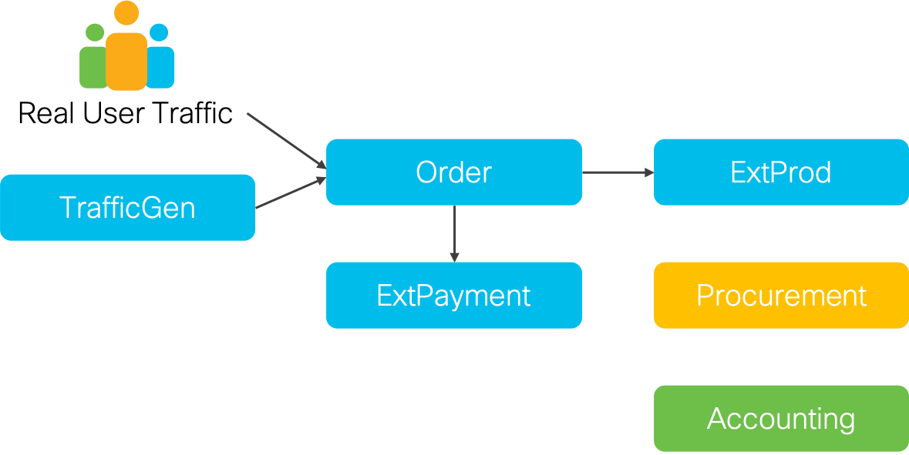

# Terraform module for deploying the Cisco Kubernetes Demo application

The Cisco Kubernetes demo application consists of multiple building blocks that interact. During your setup of this application you might decide to set up one, a few, or all of the components. You can also set up different components on different clusters and connect them with each other. This documentation will first explain the high-level design of the application before diving into each sub-component and explaining the customization and adaptation options for each of them.

## High-level application design

The application consists of six main building blocks that can be seen in the image below.

